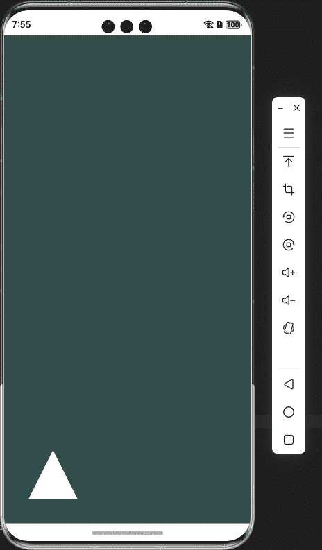

## @jemoc/gles

---

### 下载安装

```shell
ohpm install @jemoc/gles
```

需要arkTS侧使用egl环境，可以安装[@jemoc/egl](https://ohpm.openharmony.cn/#/cn/detail/@jemoc%2Fegl)


---

### 基本用法

#### 导入库

```typescript
import { gles } from '@jemoc/gles';
```

#### 使用opengl定义的GLenum类型值

```typescript
//使用枚举类型
gles.GLbitfield.GL_COLOR_BUFFER_BIT
//直接使用
gles.GL_COLOR_BUFFER_BIT
```

---

### 0.2.2 新增NativeImage支持

#### NativeImage需要egl环境支持。可以实现渲染视频帧/同层渲染等需求。复杂NativeWindow操作，需要自己实现napi功能。详细查询[OH_NativeImage](https://developer.huawei.com/consumer/cn/doc/harmonyos-references-V13/_o_h___native_image-V13#oh_nativeimage-1)

```typescript
let nativeImage = new gles.NativeImage(); //创建NativeImage，可以使用在try catch中执行。创建失败会抛出错误
let surfaceId = nativeImage.surfaceId; //创建surfaceId成功后可以获取surfaceId  


//以下在egl上下文环境并执行了eglMakeCurrent

//创建GL_TEXTURE_EXTERNAL_OES纹理
//以下0.3不适用
// let texture = new gles.Texture(gles.GL_TEXTURE_EXTERNAL_OES)
// texture
//   .setParameter(gles.GL_TEXTURE_WRAP_S, gles.GL_REPEAT)
//   .setParameter(gles.GL_TEXTURE_WRAP_T, gles.GL_REPEAT)
//   .setParameter(gles.GL_TEXTURE_MIN_FILTER, gles.GL_LINEAR)
//   .setParameter(gles.GL_TEXTURE_MAG_FILTER, gles.GL_LINEAR)
let texture = gles.glGenTextures(1)[0]
//let texture = new globjects.Texture(); //0.3修改

let error = nativeImage.attachContext(texture.id)

//设置帧可用回调，官方文档说明不允许在回调中调用NativeImage其他方法
nativeImage.setOnFrameAvailableListener(() => {
  console.log('frame available')
})

//更新纹理
nativeImage.updateSurfaceImage()

```

FragmentShader中需要加上以下代码

```shell
#extension GL_OES_EGL_image_external_essl3 : enable
```

---

### 0.3.0版本改动

#### gles库改动

- 新增glGetVertexAttribPointerv、glShaderBinary、glMapBufferRange和glUnMapBuffer方法
- 修正glUniformiv类方法签名错误

#### 自0.2.0版本新增的opengl封装类从gles中拆分，现归档在globjects模块中。globjects现属于实验阶段，需要稳定性请使用gles原方法

```typescript
import { globjects } from '@jemoc/gles'

//0.2.0时，对象资源值是通过id获取的，0.3.0改为handle
let buffer = new globjects.Buffer()
//通过handle值获取对象资源，无其他大改动
gles.glDeleteBuffers(buffer.handle)

```

#### 增加glm模块

- 该库现已实现向量和矩阵对象，提供glm常用方法，底层数据以列主序存放,该库只是模拟c库glm实现暂未实现simd加速(后续考虑)。
- 现提供以下方法(通过glm命名空间调用) radians
  degrees
  translate
  scale
  normalize
  inverse
  rotate
  ortho
  perspective
  dot
  cross
  length
  abs
  transpose

```typescript
import { glm } from '@jemoc/gles'

/***
 * 创建向量
 */
//向量初始化方式
let vec1 = glm.vec1() //无参为初始化，0向量, vce是float类型向量
vec1 = glm.vec1(1.0) //标量初始化

let vec2 = glm.vec2([1, 1]) //数组初始化
let vec3 = glm.vec3(vec2, 1.0)
vec3 = glm.vec3(1, 2, 3)
let ivec = glm.ivec1() //整形向量
let uvec = glm.uvec1() //无符号整形向量
let dvec = glm.dvec() //double

let v = glm.Vec(2, Float32Array) //通用向量创建方式，第三参数开始为不定参数

glm.vec2().add(glm.vec2()) //向量相加
glm.vec2().sub(glm.vec2()) //向量相减
glm.vec2().mul(glm.vec2()) //向量相乘
glm.vec2().mul(glm.mat2x3()) //向量与矩阵相乘
glm.vec2().div(glm.vec2()) //向量相除  


/**
 * 创建矩阵
 */

let mat = glm.mat2() // 默认为0矩阵
let mat = glm.mat2(1) //标准向量
let mat = glm.mat2(1, 1, 1, 1)
let mat = glm.mat2([1, 1, 1, 1])
let mat = glm.mat2(glm.vec2(1), glm.vec2(2)) //使用向量初始化

//矩阵也支持加减乘除操作，这里不多做介绍
        


```

---

### 绘制三角形

##### 定义shader和顶点数组

```typescript
let vertex_list = new Float32Array([
  -0.5, -0.5, 0.0,
  0.5, -0.5, 0.0,
  0.0, 0.5, 0.0,
]);

let vertexShaderSource =
  `version 300 es
        layout(location = 0) in vec4 a_position;
        layout(location = 1) in vec4 a_color;
        out vec4 v_color;
        void main()
        {
            gl_Position = a_position;
            v_color = a_color;
        }`;

let fragmentShaderSource =
  `#version 300 es
      precision mediump float;
      in vec4 v_color;
      out vec4 fragColor;
      void main()
      {
          fragColor = v_color;
      }`;
```

##### 使用封装方法

```typescript
let buffer = new globjects.Buffer(gles.GL_ARRAY_BUFFER);
buffer.setData(vertex_list, gles.GL_STATIC_DRAW);

let vao = new globjects.VertexArray();
vao.enable(0);
vao.setBuffer(vbo, 0, 3, gles.GL_FLOAT, false, 3 * 4, 0);

let program = new globjects.Program();
let vertexShader = new globjects.Shader(gles.GL_VERTEX_SHADER, vertexShaderSource);
let fragmentShader = new globjects.Shader(gles.GL_FRAGMENT_SHADER, fragmentShaderSource);
program.attach(vertexShader, fragmentShader);
program.bind();

vao.drawArrays(gl.GL_TRIANGLES, 0, 3)

//eglSwapBuffer  

```

##### 原始方法

```typescript

//申请buffer
let bufs = gles.glGenBuffers(1);
let vbo = bufs[0];
gles.glBindBuffer(gles.GL_ARRAY_BUFFER, vbo);
gles.glBufferData(gles.GL_ARRAY_BUFFER, vertex_list, gles.GL_STATIC_DRAW);

let program = gles.glCreateProgram();
let vertexShader = gles.glCreateShader(gles.GL_VERTEX_SHADER);
let fragmentShader = gles.glCreateShader(gles.GL_FRAGMENT_SHADER);

gles.glShaderSource(vertexShader, vertexShaderSource);
gles.glCompileShader(vertexShader);
let result = gles.glGetShaderiv(vertexShader, gles.GL_COMPILE_STATUS);

if (!result) {
  let info = gles.glGetShaderInfoLog(vertexShader);
}

gles.glShaderSource(fragmentShader, fragmentShaderSource);
gles.glCompileShader(vertexShader);
result = gles.glGetShaderiv(fragmentShader, gles.GL_COMPILE_STATUS);

if (!result) {
  let info = gles.glGetShaderInfoLog(fragmentShader);
}

gles.glAttachShader(program, vertexShader);
gles.glAttachShader(program, fragmentShader);
gles.glLinkProgram(program);

let status = gles.glGetProgramiv(program, gles.GL_LINK_STATUS);
if (!status) {
  let info = gles.glGetProgramInfoLog(program);
}

gles.glUseProgram(program);
gles.glDeleteShader(vertexShader);
gles.glDeleteShader(fragmentShader);

let vao_list = gles.glGenVertexArrays(1);
let vao = vao_list[0];
gles.glBindVertexArray(vao);
gles.glBindBuffer(gles.GL_ARRAY_BUFFER, vbo);
gles.glBufferData(gles.GL_ARRAY_BUFFER, vertex_list, gles.GL_STATIC_DRAW);

gles.glVertexAttribPointer(0, 3, gles.GL_FLOAT, gles.GL_FALSE, 12, 0);
gles.glEnableVertexAttribArray(0);
gles.glUseProgram(program);

gles.glDrawArrays(gles.GL_TRIANGLES, 0, 3);

//eglSwapBuffer  


```

#### 在模拟器中绘制三角形结果



---

## API

| Api                                   |
|---------------------------------------|
| glActiveShaderProgram                 |
| glActiveTexture                       |
| glAttachShader                        |
| glBeginQuery                          |
| glEndQuery                            |
| glBeginTransformFeedback              |
| glEndTransformFeedback                |
| glBindAttribLocation                  |
| glBindBuffer                          |
| glBindFramebuffer                     |
| glBindRenderbuffer                    |
| glBindTexture                         |
| glBlendColor                          |
| glBlendEquation                       |
| glBlendEquationi                      |
| glBlendEquationSeparate               |
| glBlendFunc                           |
| glBlendFuncSeparate                   |
| glBlendFuncSeparatei                  |
| glBufferData                          |
| glBufferSubData                       |
| glCheckFramebufferStatus              |
| glClear                               |
| glClearColor                          |
| glClearDepthf                         |
| glClearStencil                        |
| glColorMask                           |
| glCompileShader                       |
| glCompressedTexImage2D                |
| glCompressedTexSubImage2D             |
| glCopyTexImage2D                      |
| glCopyTexSubImage2D                   |
| glCreateProgram                       |
| glCreateShader                        |
| glCullFace                            |
| glDeleteBuffers                       |
| glDeleteFramebuffers                  |
| glDeleteProgram                       |
| glDeleteRenderbuffers                 |
| glDeleteShader                        |
| glDeleteTextures                      |
| glDepthFunc                           |
| glDepthMask                           |
| glDepthRangef                         |
| glDetachShader                        |
| glDisable                             |
| glDisableVertexAttribArray            |
| glDrawArrays                          |
| glDrawElements                        |
| glEnable                              |
| glEnableVertexAttribArray             |
| glFinish                              |
| glFlush                               |
| glFramebufferRenderbuffer             |
| glFramebufferTexture2D                |
| glFrontFace                           |
| glGenBuffers                          |
| glGenVertexArrays                     |
| glGenerateMipmap                      |
| glGenFramebuffers                     |
| glGenRenderbuffers                    |
| glGenTextures                         |
| glGetActiveAttrib                     |
| glGetActiveUniform                    |
| glGetAttachedShaders                  |
| glGetAttribLocation                   |
| glGetBufferParameteriv                |
| glGetBufferParameteri64v              |
| glGetError                            |
| glGetFloatv                           |
| glGetBooleanv                         |
| glGetIntegerv                         |
| glGetInteger64v                       |
| glGetFramebufferAttachmentParameteriv |
| glGetProgramiv                        |
| glGetProgramInfoLog                   |
| glGetRenderbufferParameteriv          |
| glGetShaderiv                         |
| glGetShaderInfoLog                    |
| glGetShaderPrecisionFormat            |
| glGetShaderSource                     |
| glGetString                           |
| glGetTexParameterfv                   |
| glGetTexParameteriv                   |
| glGetUniformfv                        |
| glGetUniformiv                        |
| glGetUniformLocation                  |
| glGetVertexAttribfv                   |
| glGetVertexAttribiv                   |
| glGetVertexAttribPointerv             |
| glHint                                |
| glIsBuffer                            |
| glIsEnabled                           |
| glIsFramebuffer                       |
| glIsRenderbuffer                      |
| glIsShader                            |
| glIsTexture                           |
| glLineWidth                           |
| glLinkProgram                         |
| glPixelStorei                         |
| glPolygonOffset                       |
| glReadPixels                          |
| glReleaseShaderCompiler               |
| glRenderbufferStorage                 |
| glSampleCoverage                      |
| glScissor                             |
| glShaderBinary                        |
| glShaderSource                        |
| glStencilFunc                         |
| glStencilFuncSeparate                 |
| glStencilMask                         |
| glStencilMaskSeparate                 |
| glStencilOp                           |
| glStencilOpSeparate                   |
| glTexImage2D                          |
| glTexParameterf                       |
| glTexParameterfv                      |
| glTexParameteri                       |
| glTexParameteriv                      |
| glTexSubImage2D                       |
| glUniform1f                           |
| glUniform1fv                          |
| glUniform1i                           |
| glUniform1iv                          |
| glUniform2f                           |
| glUniform2fv                          |
| glUniform2i                           |
| glUniform2iv                          |
| glUniform3f                           |
| glUniform3fv                          |
| glUniform3i                           |
| glUniform3iv                          |
| glUniform4f                           |
| glUniform4fv                          |
| glUniform4i                           |
| glUniform4iv                          |
| glViewport                            |
| glVertexAttribPointer                 |
| glUniformMatrix2fv                    |
| glUniformMatrix3fv                    |
| glUniformMatrix4fv                    |
| glUseProgram                          |
| glValidateProgram                     |
| glVertexAttrib1f                      |
| glVertexAttrib2f                      |
| glVertexAttrib3f                      |
| glVertexAttrib4f                      |
| glVertexAttrib1fv                     |
| glVertexAttrib2fv                     |
| glVertexAttrib3fv                     |
| glVertexAttrib4fv                     |
| glBindVertexArray                     |
| glBindVertexBuffer                    |
| glDeleteVertexArrays                  |
| glVertexAttribFormat                  |
| glVertexAttribIFormat                 |
| glVertexAttribBinding                 |
| glMapBufferRange                      |
| glUnMapBuffer                         |

### 如果遇到问题

---
#### 使用中遇到问题或发现问题都可以提交 [Issue](https://gitee.com/jiemoccc/gles/issues)